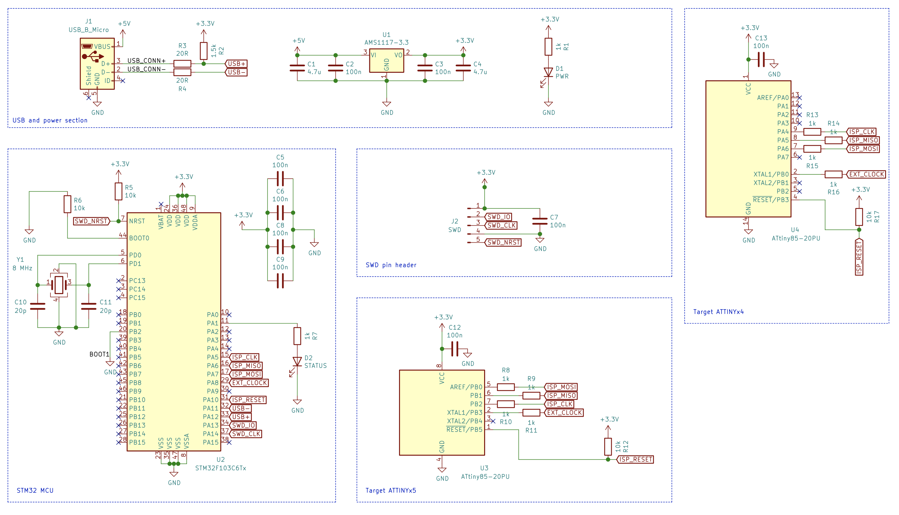

# Shiny AVR Programmer

USB AVR ISP programmer specifically designed for ATtiny25/45/85 and ATtiny24/44/84/241/441/841 microcontroller families in DIP packages.

Blasphemeously designed with an STM32 microcontroller instead of an another AVR.


# Usage

Insert the ATtiny into the DIP socket on the programmer. Please make sure it is oriented the right way. It should also work for programming the ATtinys in circuit (unless there is circuitry wired to it that would interfere, which is likely, since ATtinys don't have dedicated programming pins), but since there is no standard ISP header on the board, you will need to provide an adapter cable.

## Arduino

Shiny AVR Programmer will present to the host computer as a virtual USB serial port. It can be used seamlessly from Arduino IDE by
selecting **Tools > Programmer > Arduino as ISP** and selecting the appropriate serial port.

## avrdude

Use `-c stk500v1` command-line parameter.

## PlatformIO

Example config for ATtiny85

```ini
[env:attiny85]
platform = atmelavr
board = attiny85
upload_protocol = stk500v1
upload_flags =
    -P$UPLOAD_PORT
    -b$UPLOAD_SPEED

upload_port = <your serial port device here>
upload_speed = 19200
board_build.f_cpu = 16000000L
board_fuses.lfuse = 0xD1
board_fuses.hfuse = 0xDF
board_fuses.efuse = 0xFF
```

Example config for ATtiny84. It requires some modifications to use the [avrdude.conf from ATTinyCore](https://github.com/SpenceKonde/ATTinyCore/blob/master/avr/avrdude.conf) instead of the default one bundled with PlatformIO (`chip_erase_delay` is too low in the stock one)

```ini
[env:attiny84]
platform = atmelavr
board = attiny84
upload_protocol = custom
upload_flags =
    -C$PROJECT_PACKAGES_DIR/framework-arduino-avr-attiny/avrdude.conf
    -p$BOARD_MCU
    -P$UPLOAD_PORT
    -b$UPLOAD_SPEED
    -cstk500v1
upload_command = avrdude $UPLOAD_FLAGS -U flash:w:$SOURCE:i

upload_port = <your serial port device here>
upload_speed = 19200
board_build.f_cpu = 8000000L
board_fuses.lfuse = 0x62
board_fuses.hfuse = 0xDF
board_fuses.efuse = 0xFF
```

# Hardware

The schematic and PCB layout are in the [kicad](./kicad) folder.




# Firmware

Firmware is based on [ArduinoISP](https://github.com/arduino/arduino-examples/blob/main/examples/11.ArduinoISP/ArduinoISP/ArduinoISP.ino) with the 
appropriate modifications for the specifics of hardware (LEDs, SPI parameters, ...) and it adds the capability to provide external clock to be able
to program ATtinys that have had their fuses set to rely on external clock or crystal.

# Roadmap

- Provide an external clock for chips with fuse bits requiring it
- High voltage programming support for chips `RSTDISBL` or debugWIRE fuse bits set  
- Managed power supply or a PTC to prevent damaging the chips 
  that are inserted upside down in the socket.